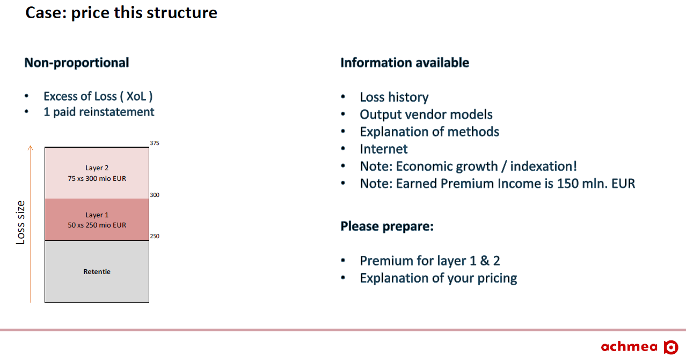

- 👋 Hi, I’m @AchmeaRe

Achmea Reinsurance is the group reinsurer of Achmea. In that role Achmea Reinsurance cedes and accepts catastrophe risks to / from other reinsurers. 
The business case is about the pricing of a catastrophe reinsurance contract. 
Some simple quantification techniques are introduced, after which the students will be calculating the price themselves (in groups). 
At the end of the business case the prices will be compared to the actual market price.

Available files:

Asset_Bedrijvendag2022_Theory_AchmeaRe - provides you with an overview of 2 methods used to determine the expected gross loss for a reinsurer

